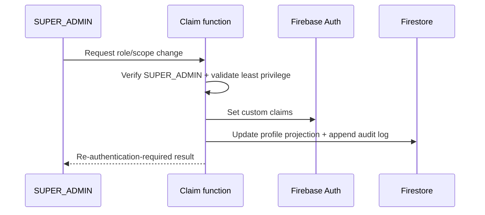

# Security and RBAC

Roles are stored as Firebase Auth custom claims for coarse authorization and
projected into `users/{uid}` for UI display. Only a privileged trusted function
may change claims, and it must write an audit log. Firestore profile values never
grant authority by themselves.

Current production claims must include `claimsVersion: 1` and `isActive: true`.
Protected Cloud Functions verify both the token claims and the current trusted
`users/{uid}.isActive` profile so disabled accounts and stale claims fail closed.

## Permission matrix

| Capability                               | CUSTOMER             | STAFF                       | ADMIN                     | SUPER_ADMIN (future) |
| ---------------------------------------- | -------------------- | --------------------------- | ------------------------- | -------------------- |
| Read active public catalog/categories    | Yes                  | Yes                         | Yes                       | Yes                  |
| Manage own profile/address/cart/wishlist | Yes                  | Own only                    | Own only                  | Own only             |
| Read own orders/payments/returns         | Yes                  | Own + assigned support view | All                       | All                  |
| Create checkout/review/return request    | Eligible own records | Eligible own records        | Eligible own records      | Eligible own records |
| Manage products/categories/media         | No                   | If explicit catalog scope   | Yes                       | Yes                  |
| Adjust inventory                         | No                   | If explicit inventory scope | Yes                       | Yes                  |
| Transition orders/returns                | No                   | Valid scoped transitions    | Yes                       | Yes                  |
| Issue refunds/manage payments            | No                   | No by default               | Explicit trusted function | Yes                  |
| Manage coupons/reviews/customers         | No                   | Assigned scopes only        | Yes                       | Yes                  |
| Read audit logs/security settings        | No                   | No                          | Read                      | Read/manage          |
| Assign ADMIN/SUPER_ADMIN                 | No                   | No                          | No                        | Yes                  |

`STAFF` is deny-by-default and additionally requires a bounded `permissions`
claim (for example `catalog.write`); the role name alone grants no mutation.

## Enforcement layers

1. Frontend route guards improve UX but grant no authority.
2. Firestore/Storage Rules verify authentication, ownership, public status, field
   changes, and claims for direct client access.
3. Cloud Functions verify Auth, App Check where enforced, role/scope, validated
   input, current resource state, and idempotency.
4. Admin SDK bypasses Rules, so every trusted service method performs explicit
   authorization before repository access.

## Claim management flow

No user may assign their own claims. Disabled users and stale claim versions are
rejected by private route guards, trusted callables, Firestore Rules, Storage
Rules, and session creation. Sensitive operations require recent authentication
where supported.

## Rules posture

Rules deny by default. Direct Firestore access opens only active current-claim
owner profile reads/updates and active current-claim administrator profile reads.
Profile updates are constrained to `name`, `phone`, `avatarPath`, and
`updatedAt`; role, status, email, and credential fields remain immutable from
clients. Avatar access is limited to the fixed `avatars/{uid}/profile` object,
active ownership, JPEG/PNG/WebP content, and a size below 5 MB. Emulator tests
cover anonymous, owner, other customer, staff, admin, disabled-admin,
stale-claim, field-escalation, invalid-content, and valid-owner cases.
