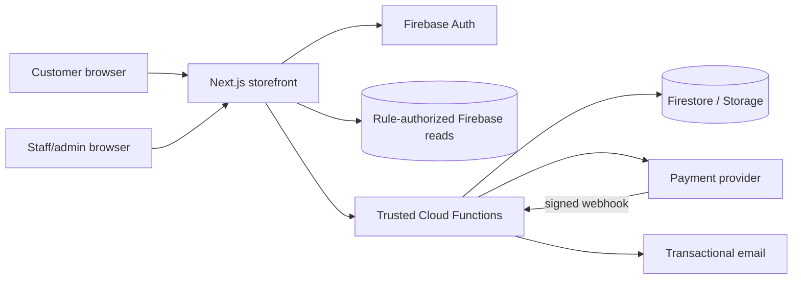
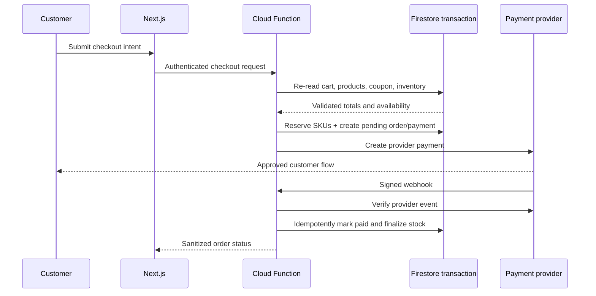
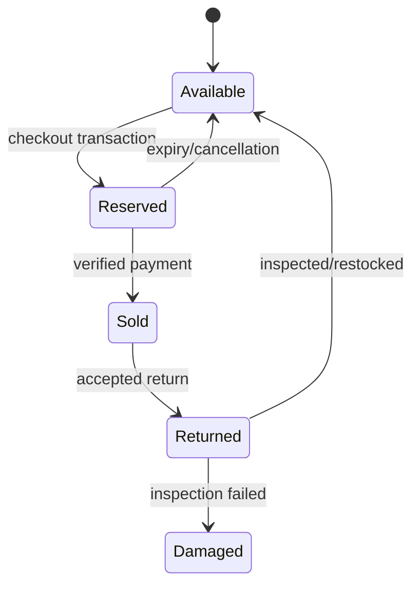

# System architecture

## Context and trust boundary

The browser is untrusted. It may read public catalog data and mutate narrowly
owned data where Security Rules explicitly allow it. Price, coupon, inventory,
order, payment, refund, role, and administrative decisions terminate in Cloud
Functions after authentication, App Check where applicable, authorization, and
server-side validation.

## Containers

| Container         | Responsibility                                      | Trust                                   |
| ----------------- | --------------------------------------------------- | --------------------------------------- |
| Next.js frontend  | SSR catalog/SEO and interactive customer/admin UI   | Public/untrusted inputs                 |
| Firebase Auth     | Identity and provider sessions                      | Managed identity boundary               |
| Cloud Functions   | Authoritative business operations and integrations  | Trusted compute                         |
| Firestore         | Operational documents and immutable order snapshots | Rules + trusted service access          |
| Storage           | Product/user media with path/content constraints    | Rules + trusted service access          |
| Provider adapters | Payments, email, courier quoting/tracking           | External; verify every response/webhook |

## Checkout and payment sequence

## Reservation lifecycle

Reservations have `reservedUntil`; a scheduled idempotent function releases
expired reservations. Every quantity change writes an inventory transaction in
the same Firestore transaction.

## Environments and promotion

| Environment | Project            | Data/provider policy                                          |
| ----------- | ------------------ | ------------------------------------------------------------- |
| Local       | `demo-bazm-online` | Emulator-only; fake email/payment/courier adapters            |
| Development | To be created      | Synthetic data and provider sandboxes                         |
| Staging     | To be created      | Production-like config, sandbox providers, restricted testers |
| Production  | To be created      | Real customers/providers; least privilege and backups         |

Projects, secrets, domains, App Check registrations, and datasets are isolated.
Promotion is commit-based: CI → development → staging verification → explicit
production deployment. Data is never copied down without anonymization.

## Architecture decisions

| Concern     | Decision                                                            | Tradeoff and extension                                                  |
| ----------- | ------------------------------------------------------------------- | ----------------------------------------------------------------------- |
| Rendering   | App Router Server Components by default                             | Client components only at interaction boundaries                        |
| State       | URL/server state first; local React state for transient UI          | Add a client cache only when measured duplication warrants it           |
| Validation  | Shared Zod contracts plus authoritative function validation         | Some schema duplication with Rules remains intentional defense-in-depth |
| Data access | Repository/service boundaries with Firestore converters             | Enables emulator tests and later storage adapters                       |
| Search      | Bounded normalized tokens initially                                 | Replace via a search adapter when catalog scale/relevance requires it   |
| Pagination  | Cursor-based, stable sort plus document ID tie-breaker              | No unbounded reads or offset pagination                                 |
| Money       | Integer minor units with currency code                              | Never use floating point for totals                                     |
| Deletion    | Archive business records; hard-delete only ephemeral/regulated data | Preserves audit and order history                                       |
| Testing     | Vitest, Rules Unit Testing, Emulator Suite, Playwright              | Risk-proportionate pyramid, not UI-only tests                           |
| Logging     | Structured event names, correlation IDs, redaction                  | No secrets, raw tokens, full addresses, or card data                    |
| Providers   | Payment/email/courier interfaces in trusted functions               | Eligibility changes do not rewrite domain logic                         |

## Failure behavior

Functions return stable error codes and safe messages; internal causes remain in
structured logs. Provider calls use timeouts, idempotency keys, bounded retries,
and webhook replay protection. Checkout fails closed if authoritative data or a
required provider is unavailable.
